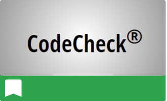
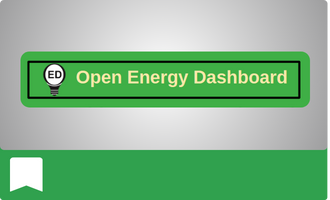

  

🍀 Greetings! I am a **3rd year Computer Engineering & Computer Science** student at **California State University, Long Beach**! On campus, as a **ChatGPT Ambassador** for [**OpenAI Edu**](https://academy.openai.com/public/clubs/higher-education-05x4z/content), I help peers to explore how AI can shape learning through hosted workshops

🍀 With my past internships & open source projects, I have about **1+ years of experience** in software engineering (front & back-end) from working/contributing at: 

  
  &nbsp;&nbsp;&nbsp;
  
  &nbsp;&nbsp;&nbsp;
  
  &nbsp;&nbsp;&nbsp;
  
  &nbsp;&nbsp;&nbsp;

>  **💻 This winter, I'm currently focusing/working on:**
> - [ 🍀 ] [**`Internship @ Buildify`**](https://www.usebuildify.com/), a $20M pre-seed startup backed by [**Google Ventures**](https://www.gv.com/) & [**Deloitte**](https://www.deloitte.com/ca/en.html)
> - [ ❤ ] **`Personal Portfolio Website`**, to display my works!
> - [ 🌱 ] **`DevSprite.io`**, project to create/build/maintain websites for small local businesses 
> - [ 😴 ] **`improving my sleep schedule...`**
> 

>  

<table>
  <tr>
    <td></td>
    <td></td>
  </tr>
</table>

These infographics were generated using [lowlighter/metrics](https://github.com/lowlighter/metrics)

